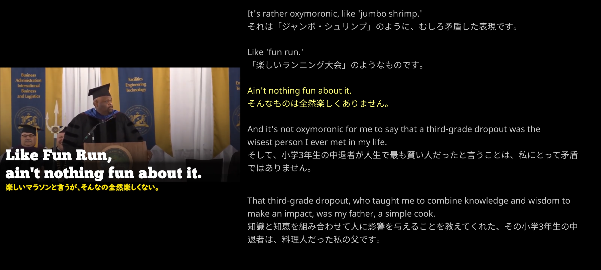
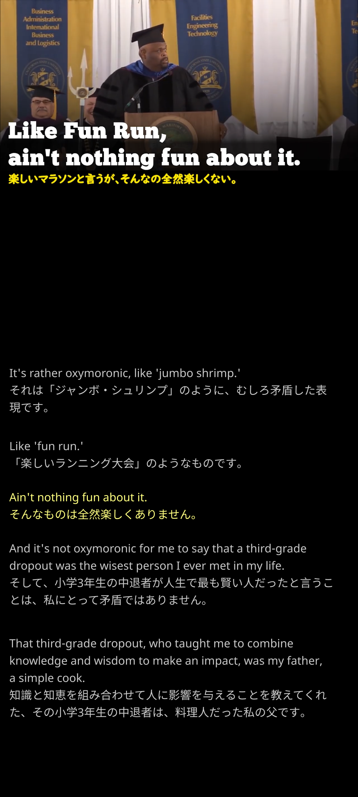

# Android : mpvExtended for Android: English Learning Setup

mpvExtended / mpv NAS Player 向けの英語学習用設定です。

## スクリーンショット
### 横画面


### 縦画面



## mpvExtended準備

mpvExtendedは、以下からダウンロードしてインストール  
https://github.com/marlboro-advance/mpvEx/releases

arm64-v8a: 最新の64bit ARMデバイス（ほとんどのユーザーに推奨）  
universal: すべてのデバイスで動作（ファイルサイズは大きめ）

### mpvExtendedのおすすめ設定

* Screen Orientation Settings  
  * [Preferences][Player] Orientation : Free


## ファイル構成

```text
mpvExtended_english_learning_pack_lua_config/
├─ README.md
├─ README_ja.md
├─ mpv.conf
└─ english-subs-android.lua
```

## 初期設定

- 横画面: 左40% 動画 / 右60% 字幕
- 縦画面: 上40% 動画 / 下60% 字幕
- 前2 / 現在 / 次2
- 前後字幕サイズ: 52
- 現在字幕サイズ: 52
- max_chars: 55
- 太字なし
- 現在字幕のマーカーなし

## Luaの配置

`english-subs-android.lua` を以下に配置します。

```text
/storage/emulated/0/Android/media/app.marlboroadvance.mpvex/english-subs-android.lua
```

`/sdcard` 表記では次と同じ場所です。

```text
/sdcard/Android/media/app.marlboroadvance.mpvex/english-subs-android.lua
```

## mpv.conf

mpvExtendedのmpv.conf編集画面に、同梱の `mpv.conf` の内容を貼り付けてください。

重要なのはこの行です。

```ini
script=/sdcard/Android/media/app.marlboroadvance.mpvex/english-subs-android.lua
```


## Lua冒頭の設定

```lua
local o = {
    landscape_panel_ratio = 0.60,
    portrait_panel_ratio = 0.60,

    prev_count = 2,
    next_count = 2,

    font_size = 52,
    current_font_size = 52,

    line_gap = 14,
    block_gap = 22,

    margin_x = 28,
    margin_y = 28,

    current_marker = "",

    -- Wrapping width correction.
    -- 1.00 = conservative/default estimate
    -- 1.15-1.25 = use more of the panel width
    wrap_width_scale = 1.20,
}
```

## 文字サイズ

前後字幕:

```lua
font_size = 52,
```

現在字幕:

```lua
current_font_size = 52,
```

例えばさらに大きくする場合:

```lua
font_size = 70,
current_font_size = 70,
```

変更後はmpvExtendedを完全終了してから起動し直してください。

## 字幕数

現在は前2 / 現在 / 次2です。

```lua
prev_count = 2,
next_count = 2,
```

前1 / 現在 / 次1:

```lua
prev_count = 1,
next_count = 1,
```

## 横・縦レイアウト比率

横画面:

```lua
landscape_panel_ratio = 0.60,
```

縦画面:

```lua
portrait_panel_ratio = 0.60,
```

値は字幕領域の割合です。

- 0.60 = 動画40% / 字幕60%
- 0.50 = 動画50% / 字幕50%
- 0.40 = 動画60% / 字幕40%
- 0.55 = 動画45% / 字幕55%

## 字幕ファイル

mpvExtendedが外部SRTとして認識している字幕を最優先で使用します。

通常のファイルパスで動画を開いている場合は、同じディレクトリから動画名で始まるSRTも探します。

例:

```text
Friends.S01E01.mp4
Friends.S01E01 English study.srt
```

## Open Document Tree / SAF

Open Document Tree経由では通常のファイルパスとして見えず、
Luaから同じディレクトリを走査できない場合があります。

mpvExtended側が外部SRTとして認識していれば、その字幕を優先して使用します。

## Custom Lua

このセットでは `Custom Lua -> Import` は使用しません。

Luaファイルを直接配置して、`mpv.conf` の `script=` から読み込みます。
